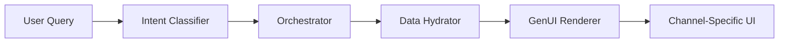

# Generative UI (GenUI) Architecture Documentation

This document outlines the architecture, components, and enterprise-grade considerations for the Generative UI Proof of Concept designed for the CAIS 2026 Keynote.

## 1. Core Architecture Flow

The GenUI system follows a 4-step orchestration pipeline to transform natural language into dynamic, data-driven UI components.



### Step 1: Intent Classification (`intentClassifier.js`)
- **Action**: Processes natural language input to identify the user's goal.
- **Output**: Returns an `intent` (e.g., `compare_plans`), `confidence` score, and extracted `parameters`.
- **Simulation**: Currently use a pattern-matching engine to simulate LLM behavior with realistic processing latency.

### Step 2: Component Orchestration (`orchestrator.js`)
- **Action**: Maps the classified intent to the most appropriate UI component.
- **Features**: 
    - **Channel Sensitivity**: Adjusts component configuration based on the target platform (Web, Mobile, or Chat).
    - **Caching**: Implements a TTL-based cache to prevent redundant processing for identical queries.
- **Output**: A comprehensive `renderConfig` tailored for the specific channel.

### Step 3: Data Hydration (`dataHydrator.js`)
- **Action**: Fetches real-time data required by the selected component using the extracted parameters.
- **Latency**: Simulates backend API calls with variable latency.

### Step 4: GenUI Rendering (`GenUIRenderer.jsx`)
- **Action**: Consumes the final JSON payload and dynamically mounts the React component.
- **Payload Structure**:
  ```json
  {
    "component": "ComparisonTable",
    "intent": "compare_plans",
    "data": { ... },
    "channel": "web",
    "renderConfig": { "layout": "grid", "animate": true }
  }
  ```

---

## 2. Component Catalog

| Component | Intent | Description | Key Features |
|-----------|--------|-------------|--------------|
| **ComparisonTable** | `compare_plans` | Side-by-side plan comparison | Responsive layouts, feature highlighting. |
| **BundleBuilder** | `build_bundle` | Custom service configurator | Interactive service selection, real-time price calculation. |
| **BillShockChart** | `explain_bill` | Visual billing breakdown | Waterfall charts explaining cost deviations. |
| **TroubleshootingWidget** | `troubleshoot` | Guided technical support | Step-by-step resolution flow, channel-specific layouts. |

---

## 3. Enterprise-Grade Implementation Patterns

When moving from a POC to a production-grade enterprise application, the following patterns should be implemented:

### A. Server-Driven Orchestration (Security)
- **Pattern**: Component selection and data hydration MUST happen on the server.
- **Reason**: Prevents exposing sensitive intent classification logic and API endpoints to the client. The client should only receive a "ready-to-render" UI instruction.

### B. Schema-Driven Communication
- **Pattern**: Use **JSON Schema** or **Protobuf** to define the interface between the orchestrator and the client.
- **Reason**: Ensures type safety and prevents UI crashes due to unexpected data structures from the LLM.

### C. Component Registry & Versioning
- **Pattern**: Maintain a centralized registry of versioned components.
- **Reason**: Allows the orchestrator to request `ComparisonTable@v2.1` while ensuring backward compatibility with older client versions.

### D. Governance & Guardrails
- **Pattern**: Implement a middleware layer to validate LLM outputs against business rules.
- **Reason**: Ensures the AI doesn't offer "free plans" or hallucinate configurations that the backend cannot support.

### E. Observability & Feedback Loops
- **Pattern**: Track "Intent Confidence" vs. "User Success Rate".
- **Reason**: If a user frequently closes the `TroubleshootingWidget` without finishing, it signals a need for intent refinement or component redesign.

### F. Multi-SDK Support
- **Pattern**: Provide GenUI SDKs for React, iOS, and Android.
- **Reason**: Standardizes how JSON payloads are interpreted across all native and web platforms for a truly unified omnichannel experience.
